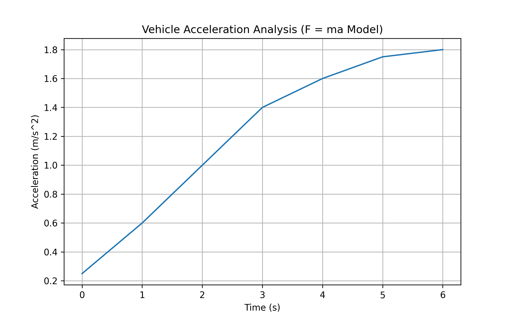

# vehicle-performance-analyzer

This project analyzes vehicle acceleration using force-time data based on Newton’s Second Law (F = ma).

# Overview
The program allows users to input force values at specific time intervals and calculates the corresponding acceleration of a vehicle.

It then visualizes the results using a graph.

# Features
- User input for time and force values
- Acceleration calculation using F = ma
- Data validation using try-except blocks
- Graph visualization (Acceleration vs Time)
- Automatic saving of the graph as an image

# Example Output

# Technical Details
- Language: Python
- Libraries: matplotlib
- Concepts used:
  - Lists
  - Loops
  - Exception handling
  - Basic physics (Newton’s Law)

# How to Run
1. Install matplotlib if not installed:
